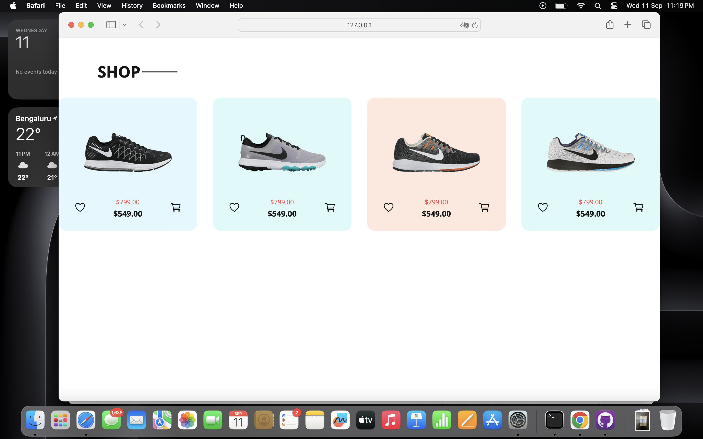

# Product Card Design

Welcome to the Product Card Design project! 🎉 This project showcases a beautifully designed product card that demonstrates the use of HTML, CSS, and JavaScript.

## Features

- **Responsive Design**: The product card adjusts to different screen sizes.
- **Interactive Elements**: Includes hover effects and clickable components.
- **Modern Styling**: Utilizes contemporary design principles for a clean look.

## Previews

Here are some previews of the product card:

- 
- 

## Installation

To get started with this project, follow these steps:

1. **Clone the Repository:**
   ```bash
   git clone https://github.com/your-username/product-card-design.git
